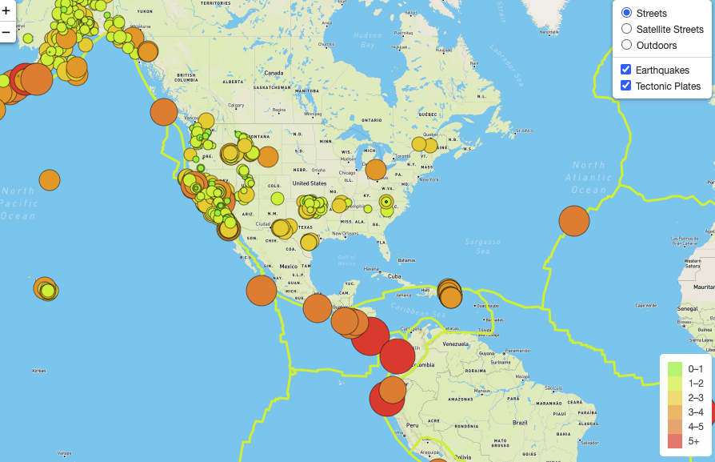

# Mapping Earthquakes

Used the Mapbox API to create a map and added GeoJSON data from the USGS Summary Feed to display the recent earthquake data. Used HTML and JavaScript to display the map as a local hosted site. Created another layer on the map to display the borders of the tectonic plates using Polygon GeoJSON data. Image of display map below. Project for UC Berkeley Data Analytics Boot Camp.

#### Recent Earthquake Map

### Tech Used
- JSON (GeoJSON)
- JavaScript
- HTML
- Mapbox

